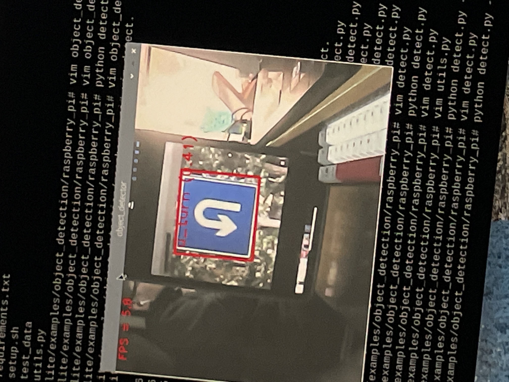
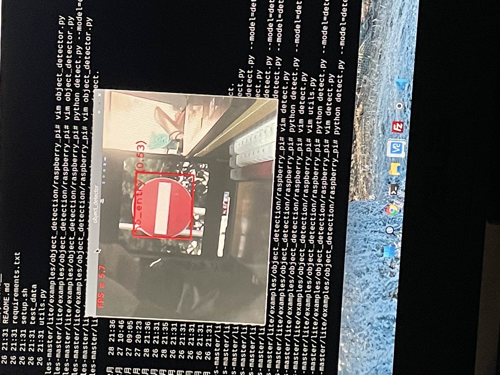
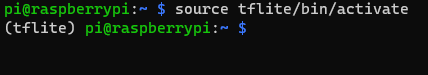
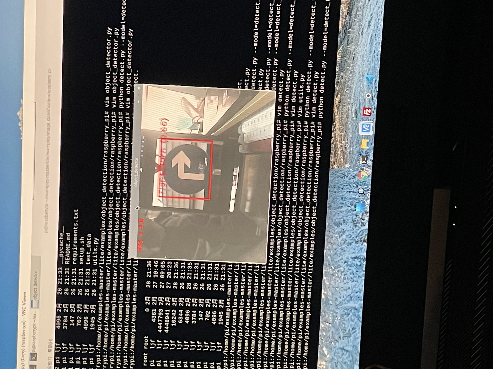

# Object_Detection_on_raspberrypi


## **具体步骤**  

> 1. 把树莓派的默认python2 删除改成 python3
> 2. 升级 pip 
> 3. 安装虚拟环境
> 4. 并且安装必要环境
> 5. 进行物体检测

***

# 1. 更改python版本
> - 进入终端  输入   
`python --version`  
查看python2的版本 比如我的是 2.7  那么执行  
`sudo apt-get autoremove python2.7`
> - 软链接python3 为 python 避免每次需要输入python3  
`sudo ln -s /usr/bin/python3.7 /usr/bin/python`  
**注意 : 里面的python版本需要输入 `python3 --version` 查看**
## 这里可以参考CSDN的一篇 [文章](https://blog.csdn.net/weixin_41656968/article/details/80214527)
***
# 2. 升级pip
直接使用清华源进行更新  
`pip install -i https://pypi.tuna.tsinghua.edu.cn/simple pip -U`
***
# 3. 安装虚拟环境
> 输入代码  
`sudo apt install virtualenv`  
在目录 **/object_detection_on_raspberrypi** 下执行下列代码
```
python -m venv tflite
source tflite/bin/activate

```  
这时你会发现你的用户名前面多了(tflite) 如下  


***
# 4. 安装必要环境(重要)
- `git clone https://github.com/liaojuncheng123/object_detection_on_raspberrypi.git`  
没有安装git的可以直接把压缩包下载并解压  
- cd 进入到文件夹 object_detection_on_raspberrypi/requirements
```
    pip install numpy-1.21.3-cp37-cp37m-linux_armv7l.whl  
    pip install opencv_python-4.5.3.56-cp37-cp37m-linux_armv7l.whl
    pip install tflite_runtime-2.7.0-cp37-cp37m-manylinux2014_armv7l.whl
    pip install tflite_support-0.3.1-cp37-cp37m-manylinux2014_armv7l.whl
```  
- **安装顺序不要反**
***
# 5. 进行物体检测(tflite环境下)
- cd 到 object_detection_on_raspberrypi/object_detection  
- 运行 `python detect.py --model=model/detect_traffic.tflite`  
- 你将看到如下图片


***

# 恭喜你成功在树莓派上部署物体检测
- 接下来我将会带来模型训练  
- 训练你自己的模型
- 不妨给个 **star** 
- 我的[Github](https://github.com/liaojuncheng123)主页
